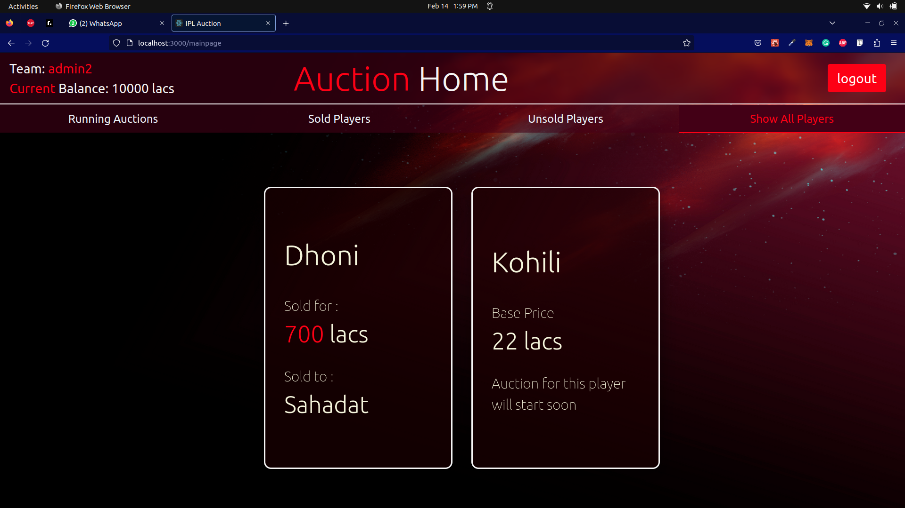
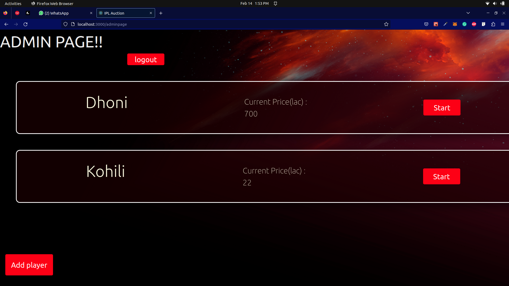
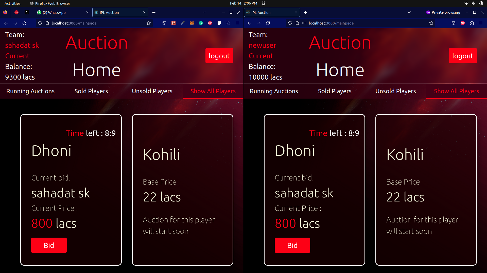

# IPL Player Auction App

This is a realtime auction application, using Node.js as backend, React.js as frontend and MongoDb as Database.

**Home Page**


**Admin Page**


**Realtime Bidding**


## Installation

use the following steps to run the projects to run this project in your local system.

### Install Node.js

Install Node.js in your system from [here](https://nodejs.org/en/download/).

### Setup MongoDb in your system

You can download MongoDb for your system form [here](https://www.mongodb.com/docs/manual/installation/). If you do not want to install it in your local system your can use Mongodb Atlas to get a MongoDb URI.
Find out more about MongoDb Atlas [here](https://www.mongodb.com/atlas/database)

### Clone the project

clone the project in your local system.

```bash
git clone https://github.com/lugnitdgp/GSOC-HEAT-Ipl_Auction_App.git
```

### Install the dependencies

Now you have to install the depedencies. In your terminal cd into the frontend directory and type

```bash
npm install
```

now cd into the backend directory and type

```bash
npm install
```

### Install nodemon

Install nodemon globally to run the

### Set up environment varibles

Create a ``.env`` file inside your project directory, And set up your environment variables. You can see ``.env.example`` for reference.

### Run the project

Run the Node.js server, First cd into backend and run

```bash
nodemon start
```

Run React frontend, cd into frontend and run

```bash
npm start
```

Now you the view the project by going to <http://localhost:3000/>

## Contribute to this project

Check out [CONTRIBUTING.md](./CONTRIBUTING.md) file to know more about contributing.
